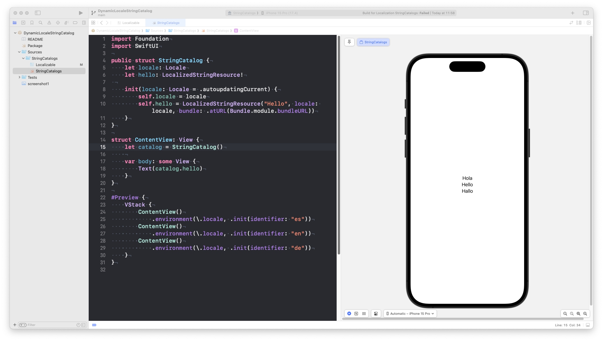

# DynamicLocaleStringCatalog

Just a sample project to demonstrate how `LocalizedStringResource` can solve this problem.

> get the correct localized String for specific locale

Issue:
https://forums.developer.apple.com/forums/thread/691532

This is specially relevant on tests, where you want to use or tests against an specific Locale, but also in SwiftUI Previews where you want to use one or multiple Locales to check all your supported languages.
